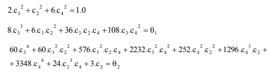

# Computational Linear Algebra - Task 1

At the index.js file, can be found the routines to solve the nonlinear system presented at the figure below:

The following methods are avaliable:
- Newton;
- Broyden.