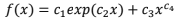

# Computational Linear Algebra - Task 2

At the index.js file, can be found the routines to solve problems with the function below:

The following calculations and methods are avaliable:
- Root:
	- Newton;
	- Bisection.
- Integration:
	- Gauss-Legendre;
	- Polynomial.
- Derivative:
	- Finite difference;
	- Richard extrapolation.